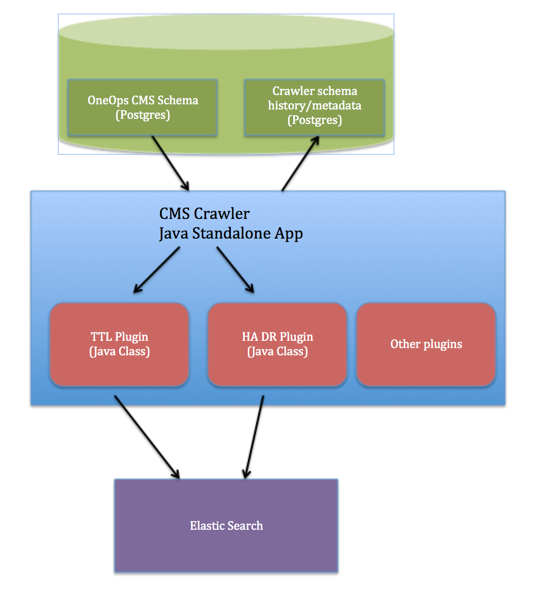

# OneOps Data Crawler (OOCrawler)

OOCrawler is a standalone Java Application which scans the OneOps data including environments, deployments, computes etc and "feeds" it to custom plugins which can do further processing as needed.
The data is processed one entity at a time - Like one environment at a time.

You can write your own plugin by extending the [AbstractCrawlerPlugin Class](src/main/java/com/oneops/crawler/AbstractCrawlerPlugin.java)

### High Level Design:


### Configuration:

#### Below are the Runtime configuration parameters - java system properties for the main class [CMSCrawler](src/main/java/com/oneops/crawler/CMSCrawler.java):
You can run the crawler locally as a java program with the above parameters

```crawler.db.user.name``` : Crawler db user. Can also be read using secrets-client config

```crawler.db.user.password``` : Crawler db password. Can also be read using secrets-client config

```crawler.db.url``` : Crawler db jdbc url, example: ```jdbc:postgresql://localhost:5432/crawler```

```cms.db.user.name``` : OneOps CMS db user. Can also be read using secrets-client config

```cms.db.user.password``` : OneOps CMS db password. Can also be read using secrets-client config

```cms.db.url``` : OneOps CMS db jdbc url

```es.host``` : ElasticSearch host. Plugins can choose to persist their data to ES

```cms.api.host``` : OneOps CMS api host. This can be used by plugins. Example: TTL Plugin uses it to disable platforms and do deployment, send notifications.

```crawler.single.run``` : Set to ```true``` if you want the Crawler to exit after going over once. If not set, it runs in a loop.

```crawler.freqency.hrs``` : If not running in a "single run", Crawler sleeps for these many hours between loops. Deafults to 6 hrs

### Build/Test:

```mvn clean test install```

### Plugins:
[TTL Plugin Class ](src/main/java/com/oneops/crawler/plugins/ttl/EnvTTLCrawlerPlugin.java)

[TTL Plugin Overview](src/main/java/com/oneops/crawler/plugins/ttl/README.md)

